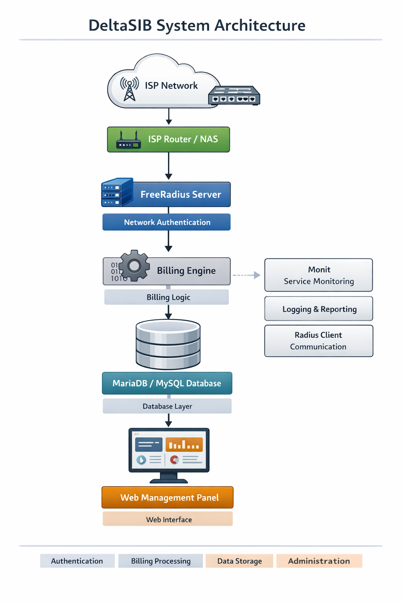
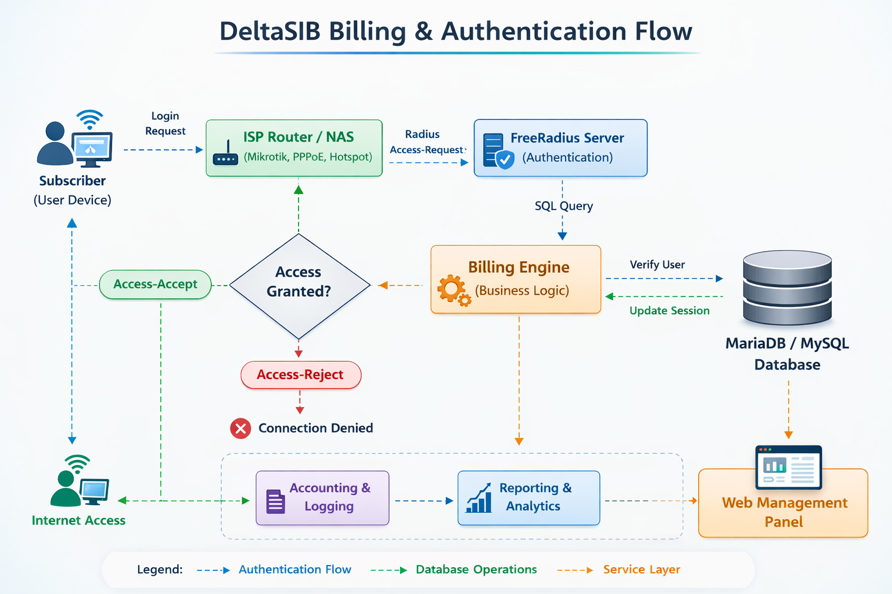

# DeltaSIB System Analysis

Technical investigation and architectural analysis of the **DeltaSIB ISP billing and management system**.

This repository documents the **reverse-engineering process, system architecture, database behavior, licensing mechanism, and service interactions** of a running DeltaSIB deployment.

The purpose of this project is to **understand how the system operates internally**, including authentication flows, licensing logic, database structures, and integration with external network components such as **FreeRADIUS and MikroTik**.

---

# Project Structure

```
deltasib-system-analysis/
│
├── README.md
├── LICENSE
│
├── investigation/
│   ├── filesystem_analysis.md
│   ├── database_analysis.md
│   ├── service_architecture.md
│
├── commands/
│   ├── system_commands.txt
│   ├── investigation_commands.txt
│
├── findings/
│   ├── licensing_system.md
│   ├── radius_integration.md
│
├── diagrams/
│   ├── system_architecture.png
│   ├── billing_flow.png
│
└── notes/
    ├── migration_plan.md
    ├── open_source_replacement.md
```

---

# Overview

DeltaSIB is an ISP management platform typically used for:

* Internet user authentication
* RADIUS accounting
* Billing management
* Customer service portals
* MikroTik / network device integration
* ISP monitoring and reporting

The system combines several components:

* **PHP Web Application**
* **MariaDB / MySQL Database**
* **FreeRADIUS Authentication Server**
* **Network Equipment Integration**
* **Hardware Licensing System**

---

# System Architecture



High-level components:

1. Web interface (`/payamavaran/www`)
2. Core PHP backend logic
3. MariaDB database
4. FreeRADIUS authentication service
5. Network equipment (routers / NAS)
6. Licensing subsystem

---

# Billing and Authentication Flow



Typical operational flow:

1. User connects to network
2. Router sends authentication request to RADIUS
3. FreeRADIUS queries DeltaSIB database
4. DeltaSIB validates user account
5. Access policy returned
6. Accounting data stored in database

---

# Investigation Areas

## Filesystem Analysis

Location of critical components:

```
/payamavaran/www/deltasib
/payamavaran/radius
/payamavaran/config
/payamavaran/bin
```

These directories contain:

* web interface
* RADIUS configuration
* system services
* licensing tools

Detailed analysis available in:

```
investigation/filesystem_analysis.md
```

---

## Database Analysis

The system uses a **MariaDB / MySQL database named**

```
deltasib
```

Core tables include:

* system_state
* users
* accounting
* reseller data
* network services

Schema documentation:

```
investigation/database_analysis.md
```

---

## Service Architecture

Important backend services include:

* FreeRADIUS
* Apache HTTP Server
* MariaDB
* DeltaSIB internal service tools

Detailed architecture notes:

```
investigation/service_architecture.md
```

---

# Key Findings

## Licensing System

The licensing system uses:

* hardware lock / dongle validation
* internal license state tracking
* database license information
* expiration checks

Details:

```
findings/licensing_system.md
```

---

## RADIUS Integration

DeltaSIB integrates with **FreeRADIUS** for:

* authentication
* accounting
* bandwidth management
* user session control

Integration details:

```
findings/radius_integration.md
```

---

# Investigation Commands

Commands used during system inspection are stored in:

```
commands/system_commands.txt
commands/investigation_commands.txt
```

These include:

* filesystem enumeration
* service inspection
* database queries
* binary analysis
* configuration discovery

---

# Notes and Future Work

Additional technical notes and ideas for system migration:

```
notes/migration_plan.md
notes/open_source_replacement.md
```

These documents explore:

* replacing proprietary components
* migrating to open-source alternatives
* designing a new architecture

---

# Disclaimer

This repository is intended **only for educational, research, and documentation purposes**.

No proprietary software or copyrighted components are distributed here.

The repository documents **system behavior and architecture analysis only**.

---

# License

This project is released under the **MIT License**.

See the LICENSE file for details.

---

# Author

Omid Muradi
